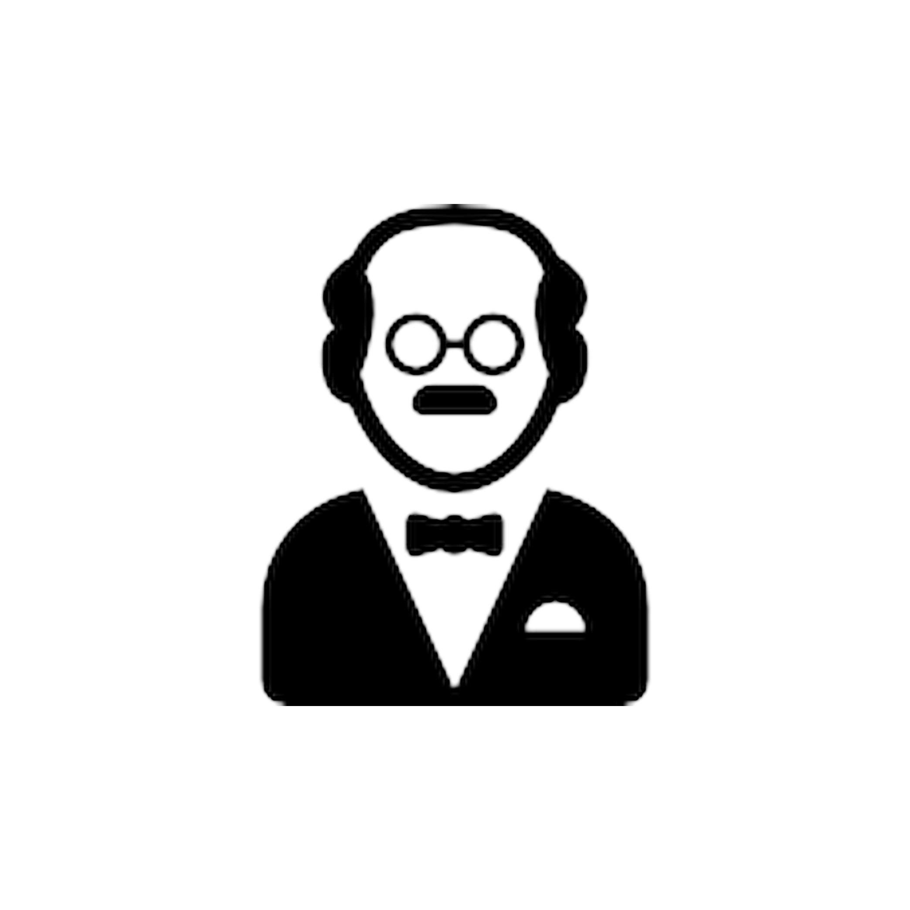

# 🧠 ¿Qué es el proyecto MCP-Nexus?

> 🇬🇧 Prefer to read in English? [Click here for the English version](./README.md)

Este proyecto tiene como objetivo **ayudar a los desarrolladores a ser más productivos** mediante una interfaz conversacional inteligente. También permite que cualquier persona acceda a una **IA generativa tipo ChatGPT gratuita e ilimitada**, ejecutándose completamente **de forma local**.

<p align="center">
  
</p>

> **Importante:** No estamos creando nuestro propio modelo de lenguaje (LLM). Utilizamos OpenRouter como una pasarela para acceder a modelos existentes de forma gratuita.

Utilizamos tecnologías modernas como:

- **MCP** (Model Context Protocol)
- **Azure AI Vision**
- **Bases de datos SQL**
- **Lectores de archivos (PDF, Markdown, etc.)**
- **Flujos inteligentes con memoria**, usando resúmenes automáticos

---

## 📸 Interfaz de Jarvis


---

## 🤖 ¿Cómo se llama esta IA generativa?

La llamamos **JARVIS**, inspirada en el asistente inteligente de Iron Man.

---

## ✅ Funcionalidades de JARVIS

### 💬 Mensajes
- Respuestas en tiempo real con streaming
- Conversaciones con soporte de memoria (resumen + mensajes recientes)

### 🖼️ Imágenes
- Vista previa de imágenes en la conversación
- Imágenes embebidas en respuestas del modelo
- Auto-scroll con nuevos mensajes o imágenes

### 📎 Archivos
- Soporte para subir imágenes, PDFs, Markdown, etc.
- Los archivos se procesan y se añaden al contexto del modelo

### 📅 Integración con MCP (Model Context Protocol)
- Actualmente integrado con **Google Calendar**
- Planeamos expandir a Notion, Slack, Gmail y más

---

## 🧠 Plan de memoria contextual

Arquitectura propuesta para mantener la memoria eficiente:

- Todos los mensajes se guardan en la base de datos
- Si el historial crece, todo se resume excepto los 10 mensajes más recientes
- Siempre se envía como contexto: `resumen + últimos mensajes + entrada actual`

---

## 🗃️ Estructura de base de datos

- Modelo `Chat`: guarda resúmenes acumulados
- Modelo `Message`: almacena cada mensaje con su rol (usuario / asistente)
- Modelo `User`: contiene los usuarios
- Modelo `UserToken`: almacena los tokens de inicio de sesión de Google y MCP
- `UserMemory`: se usa para la memoria del LLM

---

## 👥 Soporte multiusuario con MCP

El sistema usa OAuth 2.0 con tokens por usuario. Cada usuario:

- Conecta su cuenta personal de Google
- Los tokens están encriptados de forma segura
- Los eventos del calendario se consultan de forma segura y privada

---

## 🧩 Infraestructura técnica

- **Frontend**: React + CSS + MarkdownIt
- **Backend**: Flask (Auth) + FastAPI (MCP/OpenRouter)
- **Base de datos**: MySQL local → Azure Database
- **OAuth**: Google con token por usuario
- **LLM**: OpenRouter (DeepSeek, Qwen3, etc.) con streaming
- **Contenedores**: Docker + Render

---

## 🧪 Tecnologías usadas

- Python
- JavaScript
- CSS
- Docker
- Azure AI Vision
- Azure Database
- MCP
- MYSQL
- SQL

---


## 🤝 Cómo contribuir
Si estás interesado en contribuir a alguno de estos proyectos, siéntete libre de bifurcar el repositorio y enviar solicitudes de extracción. ¡Las contribuciones siempre son bienvenidas y apreciadas!

1. Clona el repositorio:

```bashgit clone https://github.com/Gustavocoello/MCP-Nexus```

## 📬 Contacto

Si tienes alguna pregunta, sugerencia o comentario, no dudes en ponerte en contacto. ¡Si deseas usarlo localmente, puedo ayudarte!Puedes contactarme a través de mi:

> - [Perfil de GitHub](https://github.com/Gustavocoello)
> - [LinkedIn](www.linkedin.com/in/gustavo-coello-01039b270)
> - [Gmail](coellog634@gmail.com)

¡Gracias por visitar mi repositorio! Espero que encuentres mis proyectos interesantes e informativos.

## 👨‍💻 Hecho por:

```bash
npm install Gustavocoello  # autor!!