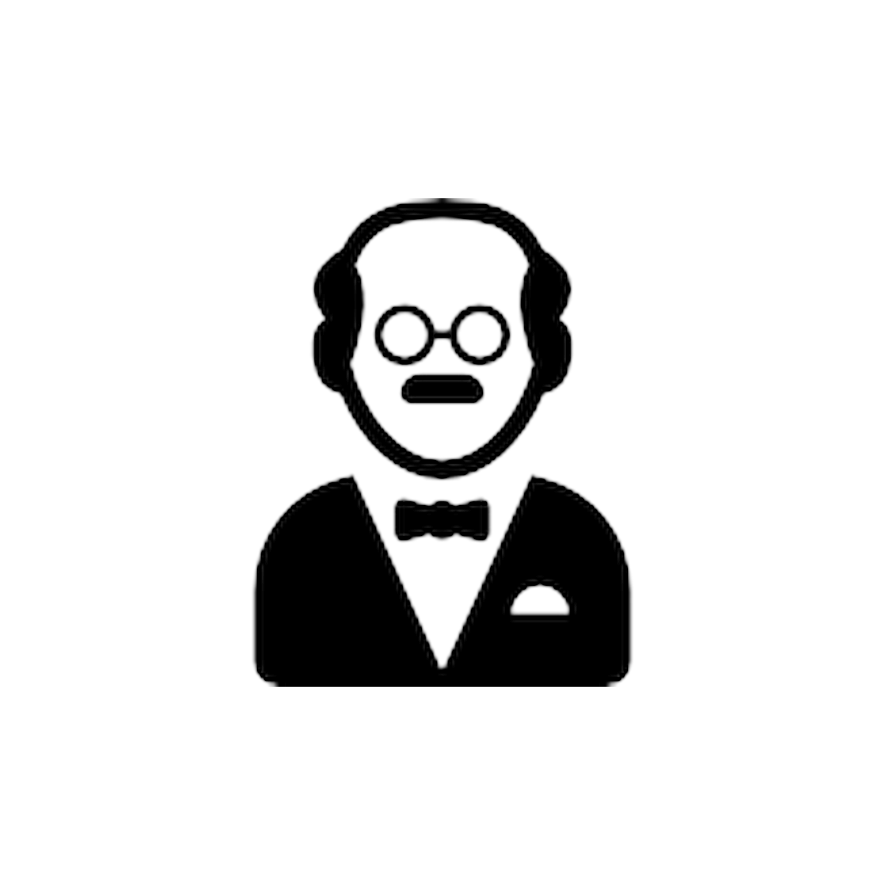
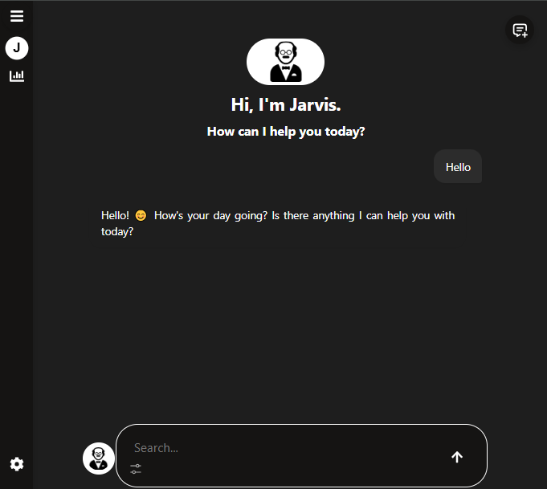

# 🧠 What is the MCP-Nexus Project?

> 🇪🇸 ¿Prefieres leer en español? [Click aquí para la versión en español](./README.es.md)

The project aims to **help developers become more productive** through an intelligent conversational interface. It also enables anyone to access a **ChatGPT-like generative AI for free and unlimited**, running entirely **locally**.

<p align="center">
  
</p>


> **Important:** We're not building a language model (LLM) ourselves. We use OpenRouter as a gateway to access existing models for free.

We use modern technologies like:

- **MCP** (Model Context Protocol)
- **Azure AI Vision**
- **SQL databases**
- **File readers (PDF, Markdown, etc.)**
- **Smart flows with memory**, using automatic summarization

---

## 📸 Jarvis Interface



---

## 🤖 What’s the name of this generative AI?

We named it **JARVIS**, inspired by Iron Man’s intelligent assistant.

---

## ✅ JARVIS Features

### 💬 Messages
- Real-time streaming responses
- Memory-supported chats (summary + recent messages)

### 🖼️ Images
- Image preview in the conversation
- Embedded images in model responses
- Auto-scroll with new messages or images

### 📎 Files
- Upload support for images, PDF, Markdown, and more
- Files are processed and added to model context

### 📅 MCP Integration (Model Context Protocol)
- Currently integrated with **Google Calendar**
- Plans to expand to Notion, Slack, Gmail, and more


---

## 🧠 Contextual Memory Plan

Proposed architecture to maintain effective memory:

- All messages are stored in the database
- If history grows, everything is summarized except the 10 most recent messages
- Always sent as context: `summary + last messages + current input`


---

## 🗃️ Database Structure

- `Chat` model: stores accumulated summaries
- `Message` model: stores each message with role (user / assistant)
- Model `users`: contains the users
- Model `UserToken`: stores the tokens for login with Google and the MCP- Model
- `UserMemory`: serves for the memory of the LLM

---

## 👥 MCP Multiuser Support

The system uses OAuth 2.0 with per-user tokens. Each user:

- Connects their personal Google account
- Tokens are securely encrypted
- Calendar events are queried securely and privately

---

## 🧩 Technical Infrastructure

- **Frontend**: React + CSS + MarkdownIt
- **Backend**: Flask (Auth) + FastAPI (MCP/OpenRouter)
- **Database**: MYSQL (local) → Azure Database
- **OAuth**: Google with per-user token
- **LLM**: OpenRouter (DeepSeek, Qwen3, etc.) with streaming
- **Containers**: Docker + Render

---


## 🧪 Technologies Used

- Python
- JavaScript
- CSS
- Docker
- Azure AI Vision
- Azure Database
- MCP
- MYSQL
- SQL

---

## 👨‍💻 Built with love by:

```bash
npm install Gustavocoello  # author!!

## 🤝 How to Contribute
If you are interested in contributing to any of these projects, feel free to fork the repository and submit pull requests. Contributions are always welcome and appreciated!

1. Clone the repository:
```bash
git clone https://github.com/Gustavocoello/MCP-Nexus
```


## 📬 Contact
If you have any questions, suggestions, or feedback, please don't hesitate to reach out. If you want to use it locally, I can help you!

You can contact me through my:
> - [GitHub profile](https://github.com/Gustavocoello) 
> - [LinkdIn](www.linkedin.com/in/gustavo-coello-01039b270)
> - [Gmail](coellog634@gmail.com)

Thank you for visiting my repository! I hope you find my projects interesting and informative.